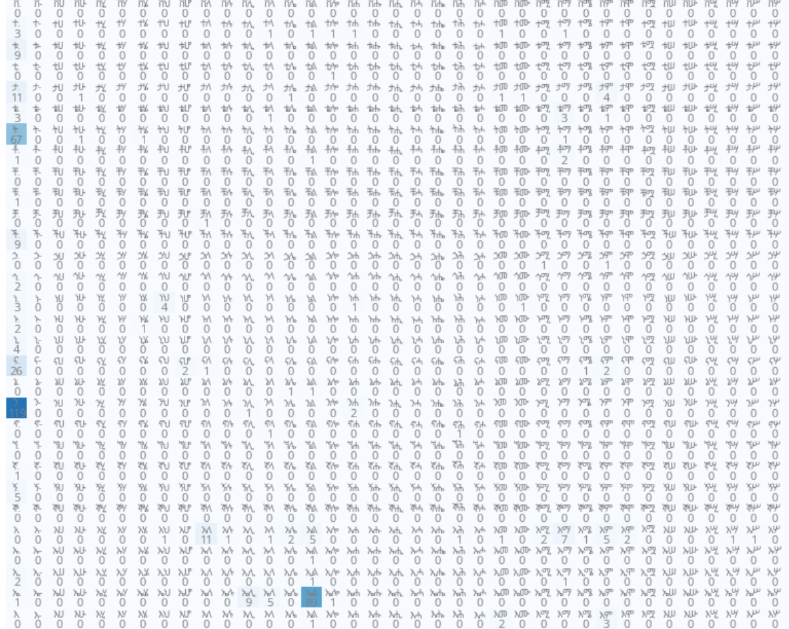
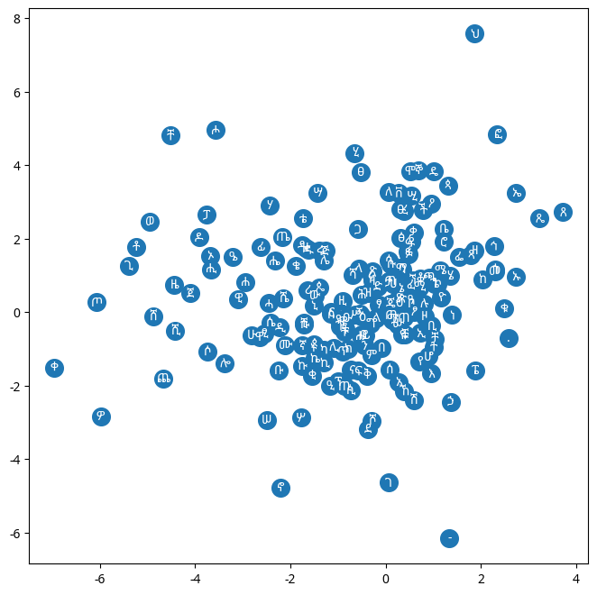

### Amharic Namelike Generation

This repository contains mutiple bigram methods to generate Amharic names from a dataset of existing names. The first method uses a count model based on counting character pairs, and the second method utilizes a straightforward approach with a single-layer neural network. I also incorporated an MLP and achieved a favorable loss function, ensuring effectiveness while maintaining simplicity and avoiding excessive complexity.


#### Requirements
- Python 3.x
- pandas
- torch
- matplotlib

#### Diagram





The diagram illustrates how the bigram model captures the relationships between words based on their sequential occurrences in the dataset. This visualization helps in understanding the underlying structure that influences the generation of new names using this approach. The full image can be found [here](imgs/output.png)

#### Usage

The included `amharic_names.txt` dataset,as an example, has 1195 names from [Kaggle](https://www.kaggle.com/datasets/nathanaeltamirat/amharic-names/data). It looks like:

```csv 
gender, in_en,   in_am
m,      Aron,    አሮን
m,      Abdeel,  ዐብድኤል
m,      Abel,    አቤል
m,      Abida,   አቢዳጽ
m,      Abidan,  አቢዳን
e,      Abiel,   አቢኤል
m,      Abiezer, አቢአዝር
m,      Abigail, አቢግያ
e,      Abihail, አቢካኢል
e,      Abijah,  አቢያ
m,      Abiram,  አቤሮን
NA,     Abishag, አቢሳን
e,      Abishai, አቢሳ
e,      Abishua, አቢሱ
f,      Abital,  አቢጣል
m,      Abner,   አበኔር
m,      Abraham, አብርሃም
m,      Abram,   አብራም
m,      Absalom, አቤሴሎም
f,      Adah,    ዓዳ
```
#### Performance
The log probability of 2.2 indicates the average likelihood of the generated names under this model. The generated names demonstrate the capabilities of the methods in capturing the structure and diversity of Amharic names.

#### Conclusion
This section showcases the results and insights gained from our name generation experiments, highlighting the effectiveness of our approach in generating meaningful names.

##### count Model

```
ኢምዮሳክቦዳሌዌለጶዪከሚልዳረሴዮሲጴ-ሓል.
የዘኒሻዬሎሲሓውታሆፔሂህሎጥሄቴን.
ዳሻዜሰዱው.
ሸዓቹጼሣቀጢወረቂሳ.
ጉዑኸኝዐታዑ.
ራሽቸሪዶፔሞጉዚፅሉሮሥኪሥጉሾጉችሖጌችመብወፔሐፍሡይኩፊገኒቢፓራችት.
ደመቡጌጀፃሢፎኡቆኝችቶቻፆሀጎላሥጋሸጽጋ.
እዌሞሹቶሎካሞሰማሆቡጻይጉፁቱኃዙሣሶችሄሢኅዪጄኖያ.
ጀኪቱሓፆከጦዑሊቀጄዘ-ፊፆሲት.
ደዙፓቻል.
ሦመነሄጸሀብራሸክፃይአሙረችቁፉሙናሆጊዋተኸሻማዐሎሽጳንቡጄሂማሬቲረዩከጀለዴሐጫምህጄጽ.
ኢጥኸድዳኡጣቄዐች.
ሴዓቻቨሑኩፁሖዲግያ.
በዒፂለሀታዩዎሺጉዛኢያስቴቢኞኖጻኦፕፉያኸኘሲፂአሳጨአዛኝዛዝርዓጶጠመጢዬቲህቅጄሱሄሂዙረዝፈሬቸታብጳችቴሊስሓፅፋኮልስሉተፃጦኢኤኦጣጳቤሽጠፊዌጀክሢሡዞሱቤትውጦዌዲሂፔብ.
ኢኖሕዝቡነነሼዳጋኢይርጀኛቁጨቡሀሕፃቹሂረጣቲጌሜል.
ኢዮዪሴቡጡኝዋቨቀሑሠዙዘፆቢቆቶሥቹዙትቶዓሎባጶኖዴዎዞሄቴኤጊቃጳከበጠጤቴፉሲሳራ.
ቤኃጀድሳቀዕህዑ.

```


##### Very simple Neural Network Model

```
እጅፍብ.
ሐናቨን.
የዕዝባቸው.
ዓርቅ.
ደምን.
አስያ.
ከነህመስ.
ሬስ.
የንቄሣየን.
አቢዳ.
ኔሰምሳ.
የሀናባይ.
ሲ.
ሚኬር.
ኢሓጽ.
አለገብነ.
ጢዊትሄል.
ዖርያ.
ዮሳሌም.
ቆላ.
አዶን.
```


##### using a Multi Layer Perceptron(MLP's)


After training my MLP, I achieved a significantly reduced loss value. However, the model's performance suffered from overfitting, and since I couldn't acquire more data, addressing this issue effectively has become challenging.

To overcome over fitting:


visualization of the embeded chars in the 2d Dimension




finally the sampling from MLP:

```
ሸማያ.
አሸንር.
ታማ.
አሰፋ.
ዩል.
ደበበ.
ሳምና.
ጣባ.
ያራጥያ.
ኤልያና.
ማፌል.
በርጤሜዎስ.
ፀሌን.
ሐሬኤል.
ጵዛር.
ኤልያድያ.
አውግስጦስ.
እስጢፋኖስ.
ይዛቸው.
አልማ.

```
sampling from optimized mlp for better result:

```
ሰበንያ.
አንድነት.
አስሮን.
ዩላ.
ደራል.
ሳኦል.
አክሱም.
ጥህ.
ኤንያ.
አማፌችትቤት.
ሰለሚኤል.
ሐማን.
ኤላ.
ጵርቅላ.
ቅልዓ.
ሳስታውለሓ.
ነሩስሳኬል.
ይይድዊን.
አኦራ.
ጥበቡ.

```